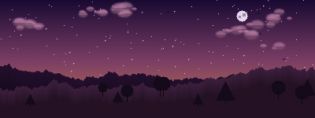
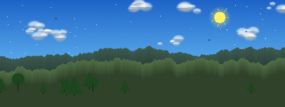

# ✦ Pixel Sky Generator

A browser-based pixel-art sky & nature background generator — inspired by the look of classic 8-bit game skies. Generate beautiful tileable/exportable backgrounds with procedurally placed clouds, mountains, trees, birds, aurora, rain, snow and more.

🔗 **[Try it live → mberkesnmz.github.io/Pixel-Sky-Generator](https://mberkesnmz.github.io/Pixel-Sky-Generator/)**

---
 


 
---

## ✨ Features

- **12 handcrafted color palettes** — Aurora Dreams, Golden Hour, Midday Clear, Misty Dawn, Storm Front, Winter Pale, Forest Dusk, Tropical Sky, Twilight Haze, Neon Night, Desert Sunset, Pastel Dream
- **Procedural generation** — every click produces a unique result using a seeded RNG
- **Layered rendering** (drawn in order): sky gradient → aurora → stars → sun/moon → far mountains → near mountains → clouds → trees → birds → rain/snow
- **Bayer ordered dithering** for authentic pixel-art gradients
- **Toggle each element** on/off independently
- **Custom canvas size** 
- **PNG export** — downloads the raw pixel-art image (unscaled)
- **Zero dependencies** — pure HTML + CSS + vanilla JS, no build step needed


No server, no npm install, no build tools required.


## 📁 Project Structure

```
pixel-sky-generator/
├── index.html      # App shell — layout + palette/toggle containers
├── style.css       # Retro pixel-art UI theme
├── generator.js    # Core image generation engine (palettes + draw functions)
└── main.js         # UI wiring — event handling, canvas scaling, export
```


## 🎨 How It Works

### Generation Pipeline

Each image is built layer by layer onto an `ImageData` buffer:

| Layer | Description |
|-------|-------------|
| Sky Gradient | Multi-stop vertical gradient with subtle per-pixel noise |
| Aurora | Sine-wave bands of translucent color in the upper sky |
| Stars | Random bright dots with occasional 2×2 sparkle |
| Sun / Moon | Circle with soft glow/rays (sun) or craters (moon) |
| Far Mountains | Random-walk ridge silhouette, darkens downward |
| Near Mountains | A second, closer ridge layer |
| Clouds | Overlapping blob clusters with bottom shadow |
| Trees | Pine (triangle) or deciduous (circle) silhouettes |
| Birds | 3-pixel V-shapes scattered across the sky zone |
| Rain | Short diagonal streaks |
| Snow | Random dots, some 2×2 |

Post-processing: optional **Bayer 4×4 ordered dithering** and **darkening pass**.

### Seeded RNG

Every generation uses a custom LCG-based pseudo-random number generator. Clicking **NEW IMAGE** reseeds it with `Date.now()`. This means generations are unique each time but the rendering itself is deterministic given the same seed — useful for reproducibility.

### Adding a Custom Palette

In `generator.js`, add a new entry to the `PALETTES` array:

```js
{
  id:    'my_palette',
  name:  'MY PALETTE',
  sky:   [[r,g,b], [r,g,b], [r,g,b]],  // 2 or 3 gradient stops, top→bottom
  cloud: [r,g,b],
  mount: [[r,g,b], [r,g,b]],            // [far, near]
  tree:  [r,g,b],
  treeHi:[r,g,b],                        // optional highlight for deciduous
  sun:   [r,g,b],                        // null = don't draw sun
  moon:  [r,g,b],                        // null = don't draw moon
  star:  [r,g,b],                        // null = don't draw stars
  rain:  [r,g,b],                        // null = don't draw rain
  snow:  [r,g,b],                        // null = don't draw snow
  aur:   [[r,g,b], [r,g,b]],            // array of aurora band colors
  bird:  [r,g,b],                        // null = no birds
  sw: ['#hex','#hex',…],                 // 8 UI swatch colors
},
```

---

## 🗺️ Roadmap

- [ ] Tile preview (2×2 grid)
- [ ] Animated preview (rain/snow/aurora movement)
- [ ] Custom palette editor UI
- [ ] Seed input field for reproducible generation
- [ ] Additional elements: lightning, shooting stars, fog, city skyline
- [ ] Pixel font overlay / watermark option

---

## 📄 License

MIT — do whatever you like with the generated images.

---

